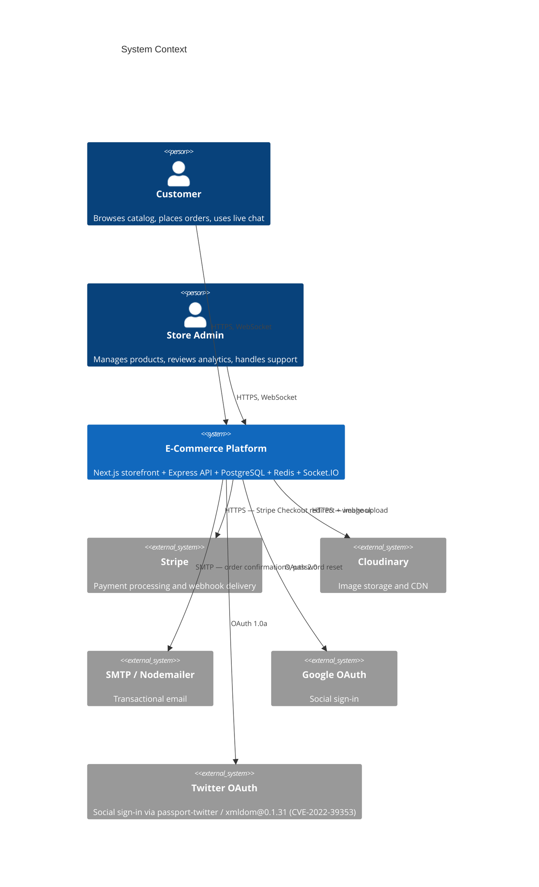
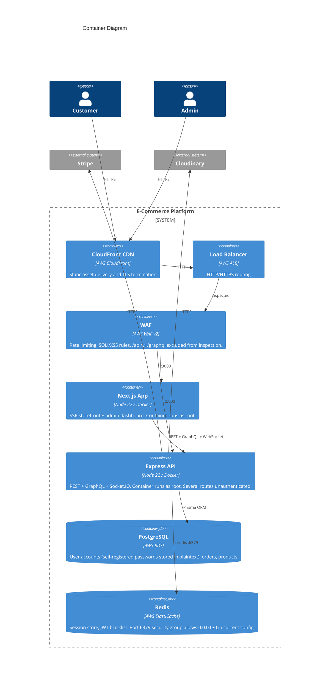
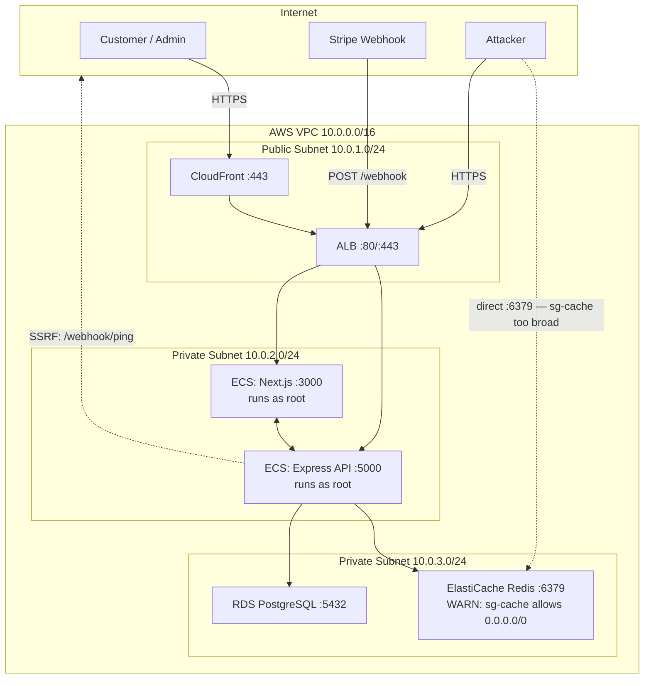
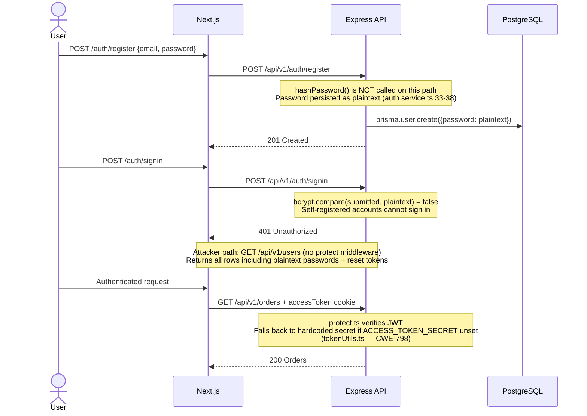
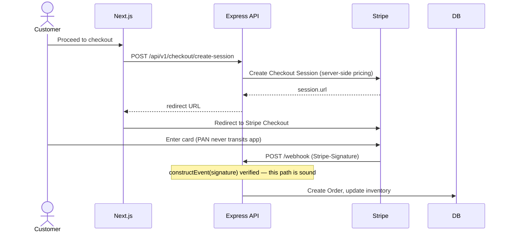
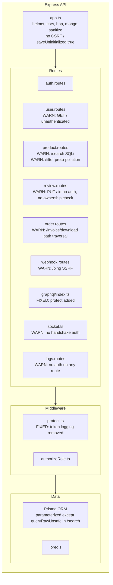

# Architecture Overview

Full-stack single-store e-commerce platform. Next.js storefront, Express API, PostgreSQL, Redis, Socket.IO, Stripe.

---

## System Context

---

## Container Diagram

---

## Network Topology

---

## Authentication Flow

---

## Order Checkout Flow

---

## Trust Boundary Summary

| Endpoint | Auth | Risk |
|---|---|---|
| `GET /api/v1/users` | None | Critical — full user dump including plaintext passwords |
| `GET/DELETE /api/v1/logs` | None | High — audit trail read and wipe |
| `POST /api/v1/auth/register` | None | Critical — stores password in plaintext |
| `GET /api/v1/graphql` | protect (post-fix) | Was unauthenticated; now gated |
| `socket.io` | None | High — no handshake auth; anonymous joinAdmin |
| `PUT /api/v1/reviews/:id` | None | High — unauthenticated IDOR, tamper any review |
| `GET /api/v1/products/search` | None | High — SQLi via queryRawUnsafe |
| `GET /api/v1/products/filter` | None | Medium — prototype pollution via bracket notation |
| `GET /api/v1/orders/invoice/download` | protect | High — path traversal in file param |
| `POST /api/v1/webhook/ping` | None | High — SSRF, fetches arbitrary URL |
| `POST /api/v1/webhook` | Stripe-Signature | Sound — constructEvent verified |

---

## API Server Component Map

