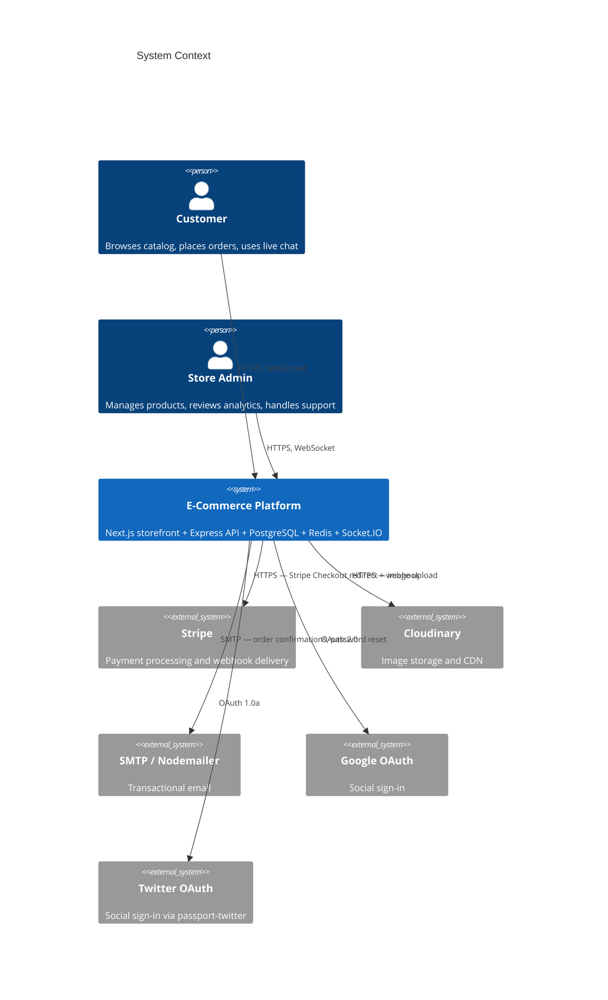
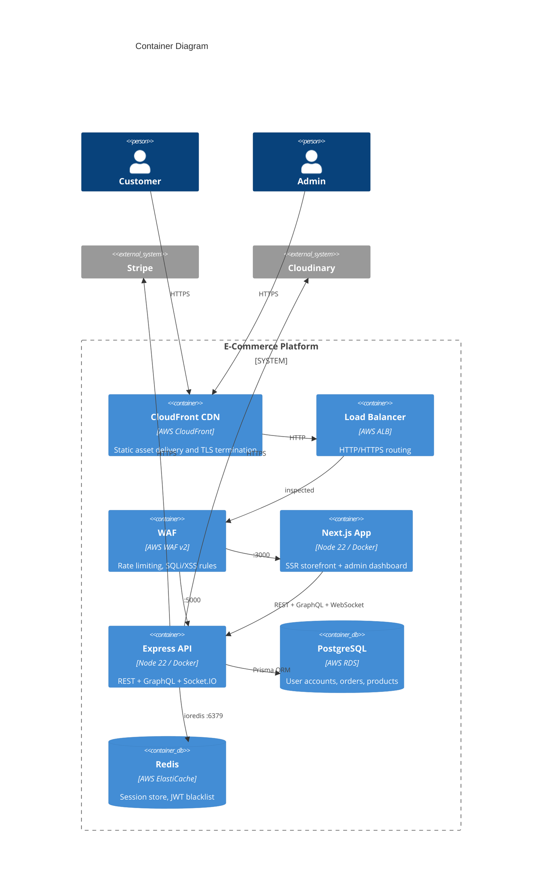
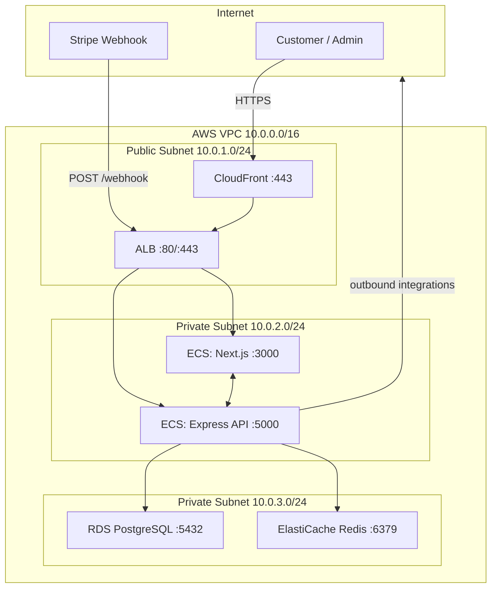
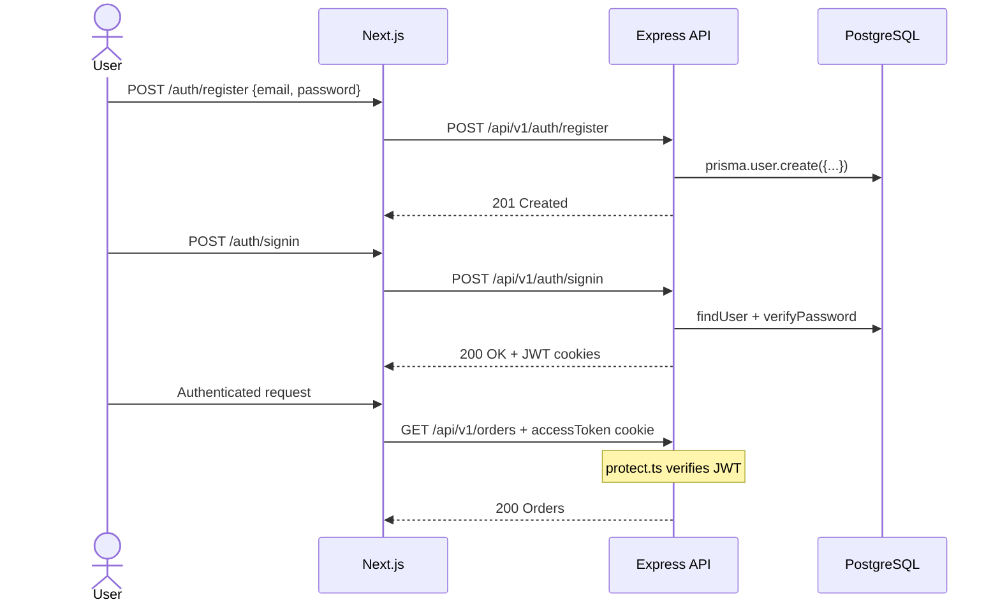
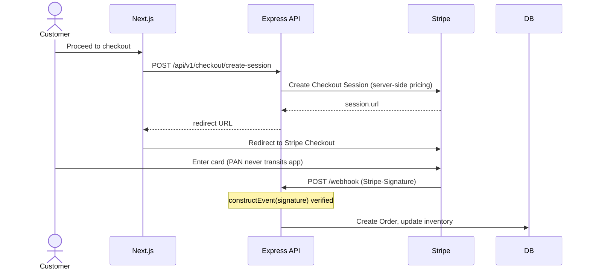
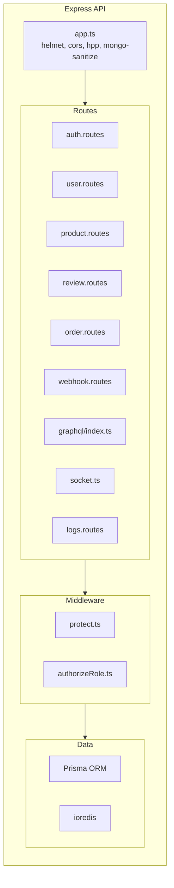

# Architecture Overview

Full-stack single-store e-commerce platform. Next.js storefront, Express API, PostgreSQL, Redis, Socket.IO, Stripe.

---

## System Context

---

## Container Diagram

---

## Network Topology

---

## Authentication Flow

---

## Order Checkout Flow

---

## API Server Component Map

